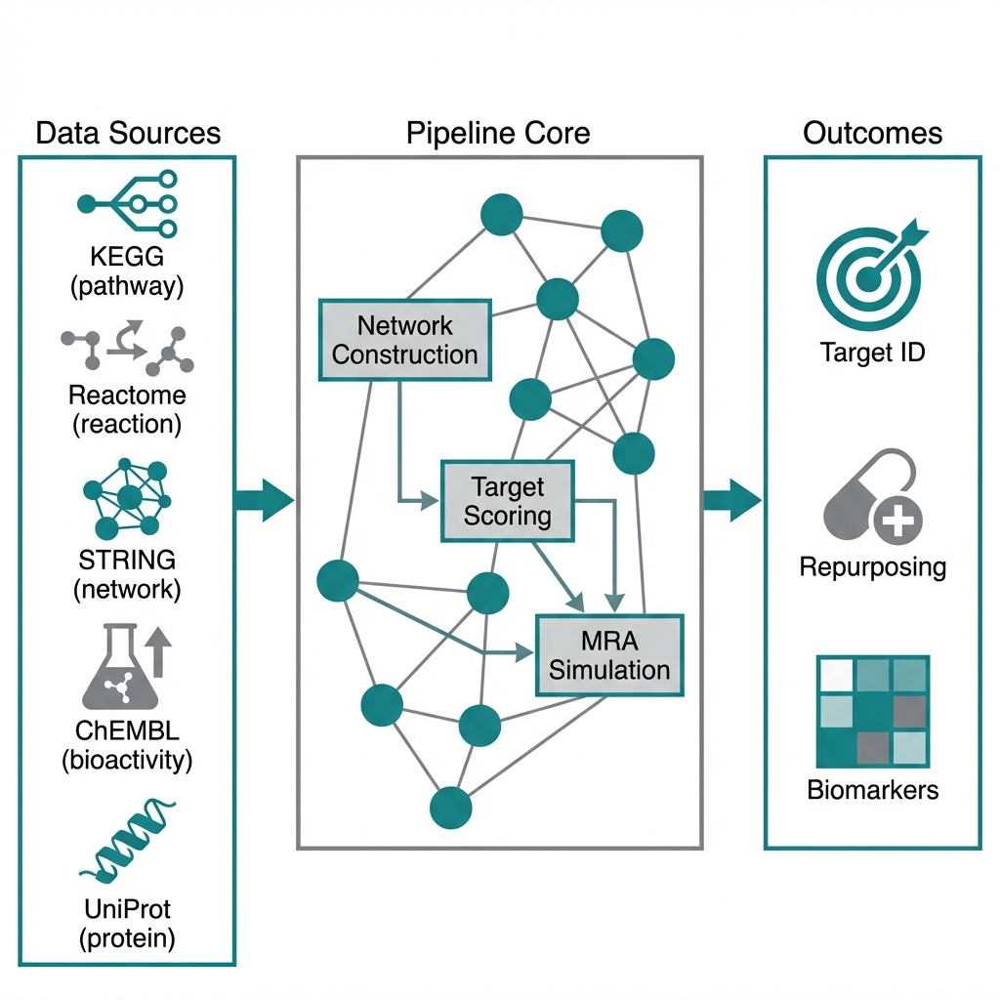

# OmniTarget: Target Discovery & Network Analysis



<p align="center">
  <strong>A network pharmacology pipeline for computational drug discovery</strong>
</p>

<p align="center">
  <a href="#scientific-use-cases">Use Cases</a> •
  <a href="#scenarios">Scenarios</a> •
  <a href="#quick-start">Quick Start</a> •
  <a href="#documentation">Docs</a>
</p>

---

## Overview

OmniTarget is a Python pipeline that orchestrates multiple biological databases via Model Context Protocol (MCP) to build disease networks, characterize therapeutic targets, and support network pharmacology workflows.

**Integrates with:** KEGG • Reactome • STRING • ChEMBL • UniProt • Human Protein Atlas

---

## Scientific Use Cases

### 🎯 Target Identification
Identify novel therapeutic targets for diseases by constructing protein-protein interaction networks and analyzing pathway enrichment across KEGG and Reactome databases.

**Example:** Identify key hub genes in breast cancer signaling networks for potential therapeutic intervention.

### 💊 Drug Repurposing
Discover existing approved drugs that may be effective against new disease indications through network-based target overlap analysis.

**Example:** Find FDA-approved kinase inhibitors that could target AXL-driven cancers.

### 🧬 Multi-Target Drug Design
Analyze polypharmacology profiles to identify compounds affecting multiple disease-relevant targets with acceptable off-target profiles.

**Example:** Design combination therapies targeting both primary oncogenes and resistance pathways.

### 🔬 Biomarker Discovery
Identify tissue-specific expression patterns and cancer biomarkers using Human Protein Atlas integration.

**Example:** Find druggable targets with tumor-specific expression for selective therapy.

### 📊 Pathway Cross-Validation
Compare disease mechanisms across multiple pathway databases to identify robust therapeutic targets.

**Example:** Validate NFκB pathway targets by cross-referencing KEGG and Reactome annotations.

### 🧪 Perturbation Simulation
Model drug effects on biological networks using Modular Response Analysis (MRA) to predict efficacy and identify feedback loops.

**Example:** Simulate EGFR inhibition effects on downstream RAF/MEK/ERK signaling.

---

## Scenarios

| # | Scenario | Description |
|---|----------|-------------|
| 1 | **Disease Network** | Multi-database disease discovery + pathway mapping + network construction |
| 2 | **Target Analysis** | Protein interaction networks + expression validation + druggability assessment |
| 3 | **Cancer Analysis** | Cancer-specific biomarkers + tissue expression + pathology data |
| 4 | **MRA Simulation** | Modular Response Analysis + perturbation modeling + feedback detection |
| 5 | **Pathway Comparison** | Cross-pathway enrichment + functional comparison across databases |
| 6 | **Drug Repurposing** | Network-based drug discovery + off-target analysis + safety profiling |

---

## Quick Start

### 1. Install
```bash
pip install -e .
```

### 2. Configure MCP Servers
```bash
cp config/mcp_servers.example.json config/mcp_servers.json
# Edit with your MCP server paths
```

### 3. Run Analysis
```bash
# Run a sample analysis
python -m src.cli yaml examples/yaml_configs/axl_breast_cancer.yaml

# Visualize results
python -m src.cli visualize results/analysis.json --interactive
```

---

## Example: AXL in Breast Cancer

```yaml
# examples/yaml_configs/axl_breast_cancer.yaml
disease: breast cancer
targets:
  - AXL
  - EGFR
  - MET
tissue_context: breast
scenarios:
  - target_analysis
  - drug_repurposing
  - mra_simulation
```

**Output includes:**
- Protein interaction network (50+ interactors)
- Drug candidates with repurposing scores
- MRA simulation of target perturbation effects
- Expression validation across tissues

---

## Repository Structure

```
omnitarget/
├── src/                    # Core pipeline
│   ├── scenarios/          # 6 scientific scenarios
│   ├── mcp_clients/        # Database integrations
│   ├── core/               # Pipeline orchestration
│   └── visualization/      # Result visualization
├── config/                 # Configuration files
├── examples/               # Example configs and scripts
├── tests/                  # Test suites
├── scripts/                # Utility scripts
│   ├── testing/            # Test runners
│   └── validation/         # Validation scripts
├── docs/                   # Documentation
└── network_pharmacology/   # Standalone visualization toolkit
```

---

## Documentation

| Document | Description |
|----------|-------------|
| [Technical Overview](docs/condensed_technical_documentation.md) | Architecture and implementation details |
| [Testing Guide](tests/README.md) | Test suite usage |
| [Examples](examples/) | Sample configurations and scripts |

---

## Citation

If you use OmniTarget in your research, please cite:

```
OmniTarget: Target Discovery & Network Analysis
Omara Soliman, 2026
https://github.com/OASolliman590/omnitarget
```

---

## License

**Academic Use License** - Free for academic research; commercial use requires separate license. See [LICENSE](LICENSE).

---

## Related Projects

- [netpharm-viz](https://github.com/OASolliman590/netpharm-viz) - Standalone network visualization toolkit

---

<p align="center">
  <sub>Built with ❤️ for computational drug discovery research</sub>
</p>
