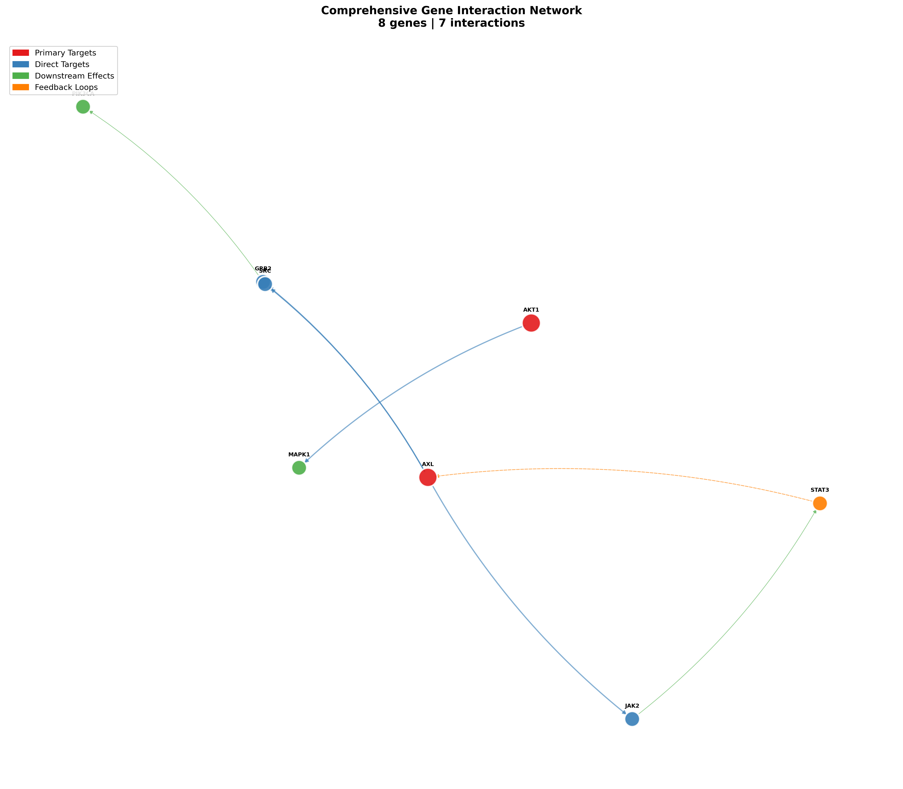

# Network Pharmacology Analysis Toolkit

A Python toolkit for analyzing gene interaction networks and drug-target relationships in the context of network pharmacology. This module is part of the [OmniTarget](https://github.com/OASolliman590/omnitarget) computational drug discovery pipeline.



---

> 🔬 **Proof of Concept** | This toolkit is a standalone demonstration of the network pharmacology visualization capabilities from **OmniTarget** — a comprehensive multi-scenario drug discovery pipeline currently in development.

---

## 🚀 Coming Soon: OmniTarget Pipeline

This module showcases just **one component** of the larger **OmniTarget** computational drug discovery platform, which includes:

| Scenario | Description | Status |
|----------|-------------|--------|
| 1️⃣ | Disease Network Construction | ✅ Complete |
| 2️⃣ | Multi-Target Scoring | ✅ Complete |
| 3️⃣ | Expression Validation | ✅ Complete |
| 4️⃣ | MRA Simulation & Network Pharmacology | ✅ **This Module** |
| 5️⃣ | Pathway Cross-Validation | ✅ Complete |
| 6️⃣ | Drug Repurposing & Safety | ✅ Complete |

**OmniTarget** leverages **MCP (Model Context Protocol)** to seamlessly integrate with biological databases including UniProt, Reactome, STRING, Open Targets, and more — enabling end-to-end computational drug discovery workflows.

⭐ **Star this repo** to stay updated on the full pipeline release!

---

## Features

- 🧬 **Gene Interaction Network Analysis**: Build and visualize gene-gene interaction networks from biological databases
- 💊 **Drug-Target Mapping**: Map drug candidates to their molecular targets within the network
- 🔄 **MCP Integration**: Retrieve data from UniProt, Reactome, STRING, and Open Targets via Model Context Protocol
- 📊 **Publication-Ready Visualizations**: Generate static (PNG) and interactive (HTML) network figures
- 🎯 **Centrality Analysis**: Identify key hub genes using network centrality metrics

## Installation


```bash
# Clone the repository
git clone https://github.com/OASolliman590/netpharm-viz.git
cd network-pharmacology

# Install dependencies
pip install -r requirements.txt
```

### Requirements

```
matplotlib>=3.5.0
networkx>=2.6
numpy>=1.20.0
plotly>=5.0.0  # Optional: for interactive visualizations
```

## Quick Start

### Using Pre-computed Results

```python
from src.data_retrieval import load_network_from_json, extract_gene_interactions
from src.visualization import NetworkVisualizer

# Load data
data = load_network_from_json('path/to/results.json')
network = extract_gene_interactions(data['mra_results'])

# Visualize
viz = NetworkVisualizer(style='publication', dpi=300)
viz.visualize_gene_network(network, 'figures/', show_all_labels=True)
```

### Command Line Interface

```bash
# Generate figures from pipeline results
python main.py --input results.json --output figures/

# Generate interactive HTML visualizations
python main.py --input results.json --output figures/ --interactive

# Run with sample data
python main.py --sample
```

## Project Structure

```
network_pharmacology/
├── main.py                 # CLI entry point
├── README.md              # This file
├── requirements.txt       # Python dependencies
├── src/
│   ├── __init__.py
│   ├── data_retrieval.py  # Data fetching from databases
│   └── visualization.py   # Network visualization functions
├── data/                  # Input data files
├── figures/               # Generated visualizations
└── examples/              # Example scripts
```

## Visualization Types

### 1. Gene Interaction Network

Shows gene-gene interactions with node types:
- 🔴 **Primary Targets**: Key therapeutic targets (e.g., AXL)
- 🔵 **Direct Targets**: First-order interaction partners
- 🟢 **Downstream Effects**: Secondary propagation nodes
- 🟠 **Feedback Loops**: Regulatory feedback circuits

### 2. Drug-Gene Targeting Network

Bipartite network showing:
- Drug candidates (squares, colored by repurposing score)
- Gene targets (circles, primary targets in red)
- Drug-target relationships (edges)

## Data Sources

The toolkit integrates with multiple biological databases:

| Database | Data Type | Access Method |
|----------|-----------|---------------|
| UniProt | Protein information | MCP / REST API |
| Reactome | Pathway data | MCP / GraphQL |
| STRING | Protein interactions | MCP / REST API |
| Open Targets | Drug-target data | MCP / GraphQL |

## Example Output

### Gene Network Statistics
```
NETWORK PHARMACOLOGY ANALYSIS COMPLETE
============================================================
Network Statistics:
  - Total genes: 45
  - Total interactions: 94
  - Primary targets: 5
  - Drug candidates analyzed: 323
============================================================
```

## API Reference

### `NetworkVisualizer`

```python
class NetworkVisualizer:
    def __init__(self, style='publication', dpi=300):
        """Initialize visualizer with style and resolution settings."""
    
    def visualize_gene_network(
        self,
        network_data: Dict,
        output_path: Path,
        show_all_labels: bool = True,
        interactive: bool = False,
        title: str = "Gene Interaction Network"
    ) -> Path:
        """Generate gene interaction network visualization."""
    
    def visualize_drug_gene_network(
        self,
        genes: List[str],
        drugs: List[Dict],
        output_path: Path,
        show_all_labels: bool = True,
        interactive: bool = False,
        title: str = "Drug-Gene Targeting Network"
    ) -> Path:
        """Generate drug-gene targeting network visualization."""
```

### `NetworkPharmacologyRetriever`

```python
class NetworkPharmacologyRetriever:
    async def fetch_gene_network(
        self,
        seed_genes: List[str],
        expand_depth: int = 2,
        min_interaction_score: float = 0.7
    ) -> Dict:
        """Fetch gene interaction network from databases."""
    
    async def fetch_drug_targets(
        self,
        target_genes: List[str],
        max_drugs_per_target: int = 10
    ) -> List[DrugInfo]:
        """Fetch drugs targeting specified genes."""
```

## Citation

If you use this toolkit in your research, please cite:

```bibtex
@software{network_pharmacology_toolkit,
  title = {Network Pharmacology Analysis Toolkit},
  author = {Your Name},
  year = {2024},
  url = {https://github.com/OASolliman590/netpharm-viz}
}
```

## License

MIT License - see [LICENSE](LICENSE) for details.

## Contributing

Contributions are welcome! Please read our [Contributing Guidelines](CONTRIBUTING.md) before submitting a pull request.

## Related Projects

- [OmniTarget](https://github.com/OASolliman590/omnitarget) - Full drug discovery pipeline
